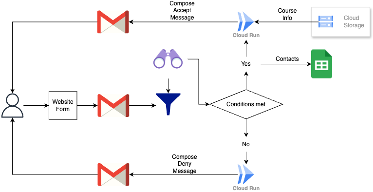
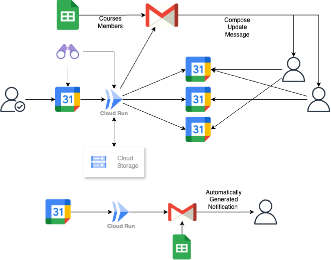

# Simple Classes Planner
An anonymized project for classes planning/managing/notification requested by a small business owner. Features combination of Sheets, Calendar and Gmail interactions. Built based on GCP (November 2024): Gmail, Sheets, Calendar, Bucket Storage, Cloud Run (serverless triggers), Firestore.

## Registration
The website of the customer includes a form for courses registration, which sends a letter to business gmail account. ***Registration*** part of the app automates answer-letters on certain conditions requested by customer. On successful registration the letter contains course description, first class date and place and, in case of multiple calendars option, a link to course calendar.

<!-- schema -->

<!-- reproduction -->
Steps to reproduce:
- Setup gmail watch for specific gmail label (where registration messages are forwarded)
- Setup Google Sheets with contacts
- Setup Cloud Storage with courses information
- Add conditions for sucessfull registration
- Setup Cloud Run function (use *registration/answer_emails.py*)
- Schedule watch renewal

## Planning and Management
***Planning*** and ***Management*** parts of the app allow for management of linked course calendars from admin calendar, adding/canceling/updating the events in calendar, copying them to linked calendars and automatically notifying subscribed clients about any changes.

<!-- schema -->

<!-- reproduction -->
Steps to reproduce:
- Check contacts spreadsheet availability
- Create bucket for calendars history and metadata
- Setup watch for admin calendar
- Setup environment (Google Artifact Registry)
- Setup Cloud Run (use *management/main.py* and the environment)
- Schedule watch renewal